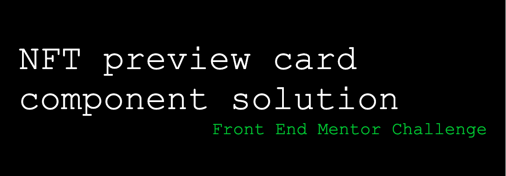

#[Frontend Mentor - NFT preview card component Challenge](https://www.frontendmentor.io/challenges/nft-preview-card-component-SbdUL_w0U)

## Table of contents

- [Overview](#overview)
  - [The challenge](#the-challenge)
  - [Screenshot](#screenshot)
  - [Links](#links)
- [My process](#my-process)
  - [Built with](#built-with)
- [Author](#author)
- [Acknowledgments](#acknowledgments)

## Overview

### The challenge

Users should be able to:

- View the optimal layout depending on their device's screen size
- See hover states for interactive elements

### Screenshot

### Links

- Solution URL: [Add solution URL here](https://your-solution-url.com)
- Live Site URL: [Add live site URL here](https://your-live-site-url.com)

## My process

### Built with

- Love ❤️ & some coffee ☕
- Semantic HTML5 markup
- CSS custom properties
- Flexbox
- CSS Grid
- Mobile-first workflow
- BEM methodology (still rusty)

## Author

- Front end mentor - [@DivineUgorji](https://www.frontendmentor.io/profile/DivineUgorji)
- Twitter - [@yourusername](https://www.twitter.com/DivineUgorji)

## Acknowledgments

Every member of the community.
